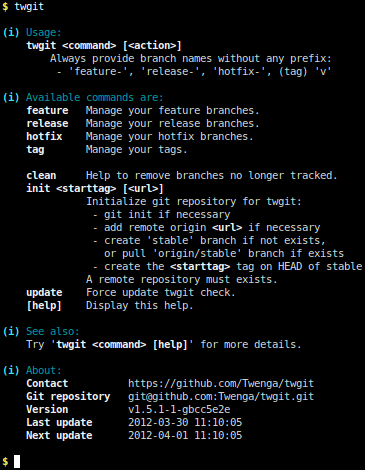
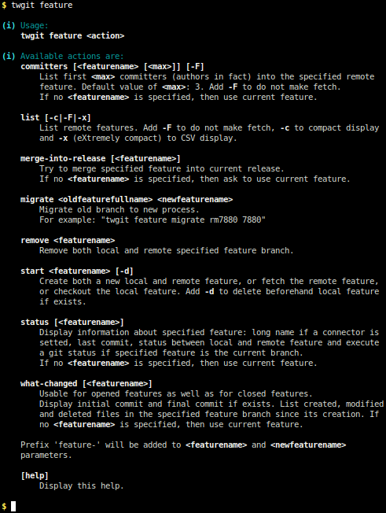
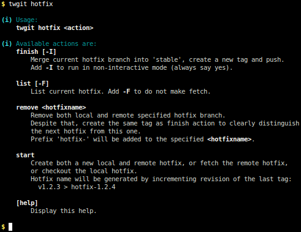
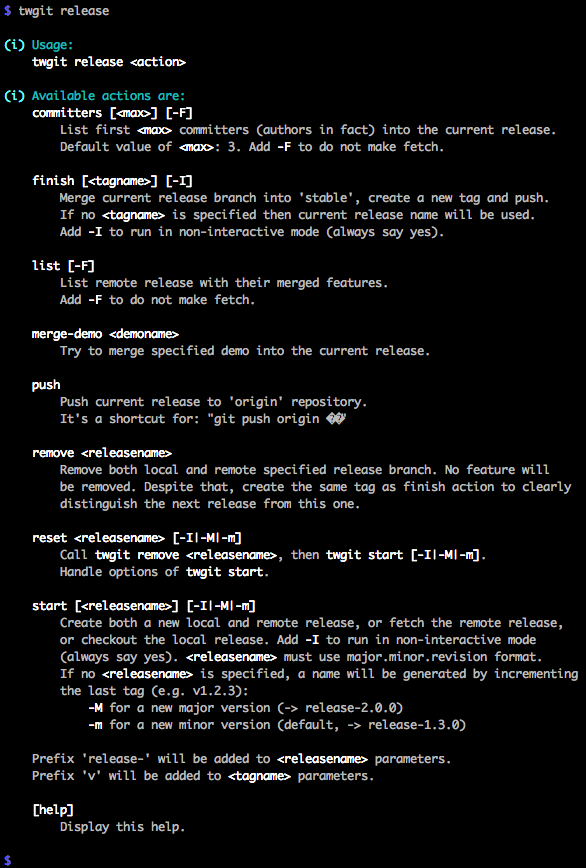
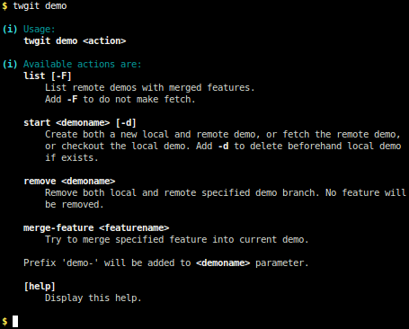
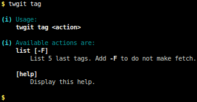

[](http://twgit.twenga.com/) TwGit
==========

#### [Homepage](http://twgit.twenga.com/)

## Description

Twgit is a free and open source assisting tools for managing features, hotfixes and releases on Git repositories.
It provides simple, high-level commands to adopt the branching model describes in our documentation (see below).

This tools is largely inspired by [GitFlow](https://github.com/nvie/gitflow), but the workflow is different.

Feel free to contribute to it if you like.

## Requirements

  - Bash v4 _(2009)_ and above or zsh
  - Git v1.7.2 _(2010)_ and above
  - php5-cli or Python 2.x for Github, [Gitlab](https://about.gitlab.com), [Jira](https://www.atlassian.com/fr/wac/software/jira),
    [Redmine](http://www.redmine.org), [Trello](https://trello.com) and [Pivotal Tracker](https://www.pivotaltracker.com) connectors (can be switched off): allow to display issue's title/subject into twgit
  - Supported operating systems: Debian/Ubuntu Linux, FreeBSD, Mac OS X

## Installing twgit

In the directory of your choice, e.g. `~/twgit`:

```bash
$ git clone git@github.com:Twenga/twgit.git .
$ sudo make install
```

More [Installation instructions](https://github.com/Twenga/twgit/wiki/Twgit#wiki-2.installation) are available in French wiki, waiting English translation...

## Getting started


## Documentation

[French documentation](https://github.com/Twenga/twgit/wiki) is available in wiki, waiting English translation...

### Help on command prompt













## Continuous integration [](http://travis-ci.org/Twenga/twgit)&nbsp;[](http://travis-ci.org/Twenga/twgit)

To run the test suite locally, simply:

```bash
$ cp conf/twgit-dist.sh conf/twgit.sh          # and adapt, if necessary
$ cp conf/phpunit-dist.php conf/phpunit.php    # and adapt, if necessary
$ phpunit -c conf/phpunit-dist.xml
```

To show estimated code coverage (_see_ [.travis.yml](.travis.yml)):

```bash
$ tests/inc/codeCoverage.sh \
    <(find $(pwd)/inc -type f -name '*.sh' && echo $(pwd)/twgit) \
    <(find $(pwd) -type f -name '*Test.php')
```

[Estimated code coverage](https://travis-ci.org/Twenga/twgit): 33.1% (661 of 1994 lines).

## Copyrights & licensing

Licensed under the Apache License 2.0.
See [LICENSE](LICENSE) file for details.

## ChangeLog

See [CHANGELOG](CHANGELOG.md) file for details.
